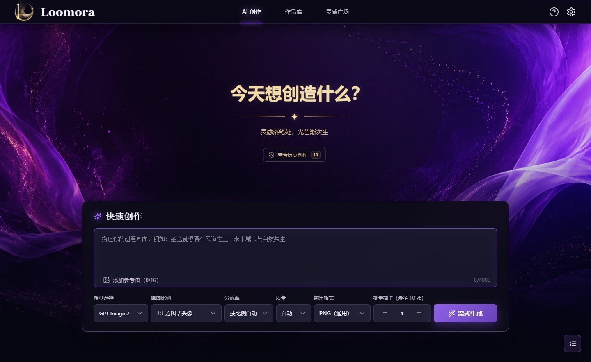
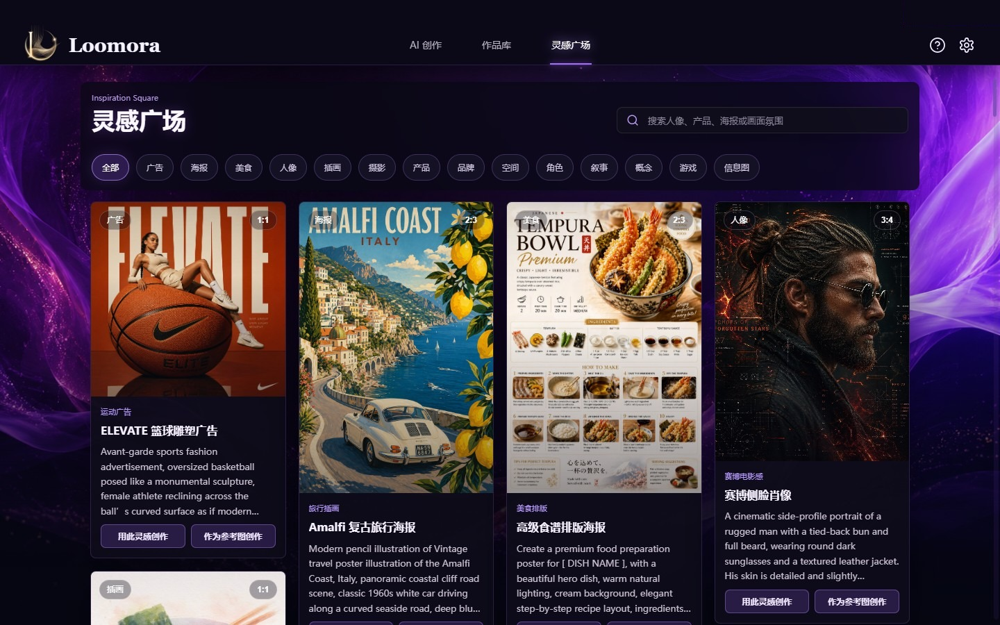
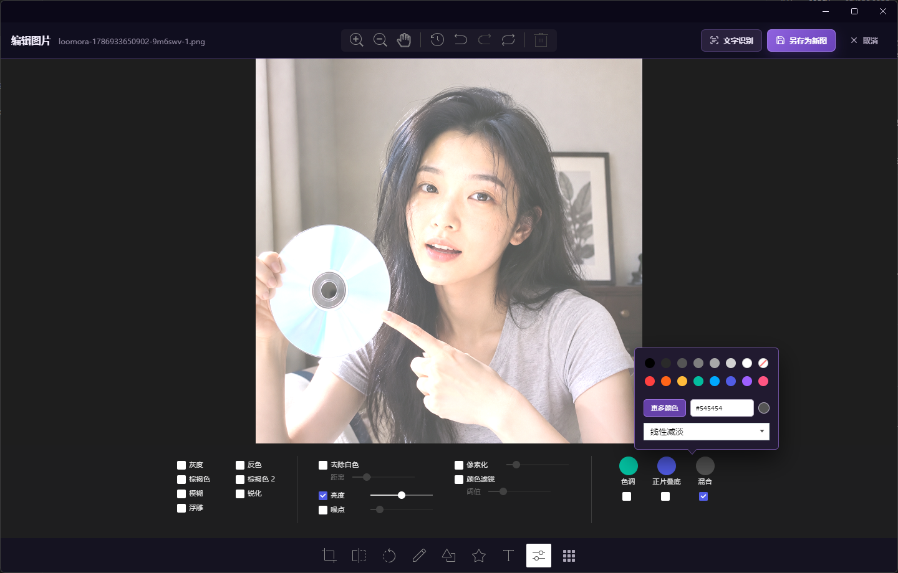

# Loomora · 织光成画

> 面向个人创作者的 AI 图片创作、管理与编辑桌面工作台。

[](https://www.electronjs.org/)
[](https://vuejs.org/)
[](https://vitejs.dev/)
[](#运行环境)
[](#license)

Loomora 将 AI 生图、聊天式创作历史、本地作品库、灵感复用、图片编辑和离线 OCR 集中在一个桌面应用中。作品、提示词、编辑版本和整理信息保存在本机；API Key 使用系统安全存储加密，不会写入作品目录或备份包，适合需要长期积累个人素材的创作者。

## 下载

| 平台    | 国内下载（Gitee）                                                    | 国际下载（GitHub）                                                      |
| ------- | -------------------------------------------------------------------- | ----------------------------------------------------------------------- |
| Windows | [前往 Gitee Releases](https://gitee.com/cuteRabbit/Loomora/releases) | [前往 GitHub Releases](https://github.com/GodofRabbit/Loomora/releases) |
| macOS   | 暂未发布，DMG 将在 macOS 构建完成后上传                              | 暂未发布，DMG 将在 macOS 构建完成后上传                                 |

Windows 安装包、更新清单和 SHA-256 校验值会同时发布到两个渠道。国内用户建议优先使用 Gitee；GitHub 作为国际下载和备用渠道。

## 核心能力

| 模块     | 当前能力                                                                  |
| -------- | ------------------------------------------------------------------------- |
| AI 创作  | Provider 能力驱动的文生图、参考图创作、批量生成、尺寸/质量/格式控制       |
| 服务接入 | OpenAI-compatible、Replicate、多 Profile、连接测试、模型列表和动态能力    |
| 生成队列 | 本地持久化、进度、点击定位、暂停、失败重试、自动拆批和已完成任务清理      |
| 创作历史 | 聊天式记录、按需加载、提示词编辑、参考图复用、原对话内重试和来源追溯      |
| 作品库   | 最新作品优先、瀑布流、日期时间轴、搜索、专辑/标签/颜色筛选                |
| 作品管理 | 文件框多选导入、拖拽导入、收藏、回收站、批量整理、导出和内容去重          |
| 图片信息 | 查看/编辑提示词、生成参数、首次服务来源、专辑、标签、颜色、备注和路径     |
| 图片处理 | TOAST UI 图片编辑器、马赛克、撤销/重做、历史记录、版本对比和版本恢复      |
| 文字识别 | Paddle.js 本地 OCR 模型、独立工作窗口、取消识别和结果复制                 |
| 数据管理 | 自定义存储目录、本地备份与恢复、清除本地数据、按 Profile 加密保存 API Key |
| 桌面体验 | Windows NSIS、macOS DMG、系统文件框、自定义标题栏和应用图标               |

<p align="center">
  
</p>

> **作者联系与咨询**：`believe_rl@163.com` · 欢迎反馈、合作、咨询。

## AI 创作



- 创作表单根据当前 Provider/Profile 和模型能力动态显示控件；不支持的参考图、比例、尺寸、质量、格式或批量选项会自动隐藏或限制。
- OpenAI-compatible 默认模型为 `gpt-image-2`，提示词上限为 4000 个字符，最多生成 10 张图片、最多 16 张参考图。
- Replicate 使用 `owner/model` 模型标识，当前按单张生成和单张参考图校验，并通过异步任务轮询获取结果。
- OpenAI-compatible 支持常用比例、尺寸、质量和输出格式；官方 OpenAI 单张请求支持流式中间图预览，第三方兼容接口会自动降级为非流式请求。
- 参考图可通过系统文件框、拖拽/粘贴等方式加入；具体数量和传输格式由当前 Provider 的能力声明与适配器决定。
- 缺少服务地址或 API Key 时会立即提示并打开设置，不会进入无效的长时间等待。
- 每次生成都会记录提示词、参数、Provider/Profile、参考图、进度和结果。历史对话中的重试会更新原记录，不会新增重复对话；重新生成、参考图创作和队列重试使用当前选中的服务。
- 生成队列中的“生成中”任务可点击跳回创作历史，并平滑定位到对应对话轮次；目标对话会短暂高亮。

### 多服务配置

设置中可以创建多个服务档案。每个档案独立保存服务类型、接口地址和模型，API Key 通过系统安全存储按 Profile 加密保存。生成队列会记录任务创建时的 `providerId` 与 `profileId`，保证排队任务可追溯；用户点击失败重试时，会按当前选中的服务重新提交。

当前内置：

- **OpenAI 兼容接口**：支持文本生图、参考图编辑、流式预览、批量生成、尺寸、质量和输出格式。
- **Replicate**：模型填写 `owner/model`，使用异步任务轮询，完成后将图片下载到本地作品库。

配置页支持连接测试和远程模型列表读取。Provider 可以声明流式、批量、参考图、尺寸、质量、格式、轮询和取消等能力；界面会根据能力隐藏或降级不受支持的选项。第三方接口地址会自动清理末尾空格、中文标点等常见粘贴问题。

## 本地作品库


- 图片默认按 `Gallery/YYYY-MM-DD/` 归档，并按日期和修改时间由新到旧展示。
- 瀑布流保持原图比例，并根据窗口宽度自动调整列数。
- 支持按名称、提示词、标签和备注搜索，也可按日期、专辑、标签和颜色快速筛选。
- 点击“导入图片”可通过系统文件框多选，也可以把外部图片直接拖入作品库。
- 相同内容通过 SHA-256 校验跳过重复导入。
- 支持大图预览、提示词抽屉、复制、重命名、下载、编辑、OCR、作为参考图创作、重新创作和打开文件位置。
- 收藏与回收站均保存在本地；回收站图片可以恢复，永久删除前会再次确认。
- 多选模式支持批量设置专辑、追加标签、颜色标记、导出和删除。
- 下载、导出和编辑器“另存为新图”会先打开系统文件框，由用户确认文件名和保存位置。
- 编辑后的新图使用保存时的最新日期进入作品库，并保留可查看、对比和恢复的版本信息。
- 大型作品库采用元数据优先、图片按需加载和窗口化渲染，降低首次加载压力。

## 灵感广场



灵感图片和提示词随应用保存在本地，浏览时不依赖远程图片地址。页面最多显示四列，可按主题筛选或搜索，并支持：

- 查看完整提示词；
- 将提示词和推荐画面规格填入快速创作；
- 直接把案例图片作为参考图开始创作；
- 打开大图预览。

## 图片编辑与 OCR



- 编辑器基于 TOAST UI Image Editor，工具名称、按钮和提示已中文化。
- 支持裁剪、翻转、旋转、涂鸦、形状、图标、文字、滤镜、颜色、透明度和画布缩放。
- 颜色工具包含预设色、详细选色面板、HEX 输入和色相指示。
- 马赛克支持笔刷大小和实时预览，并纳入统一的撤销、重做和历史记录。
- 顶部与底部工具栏不会遮挡图片；编辑器打开时不默认选中任何工具。
- Paddle.js OCR 模型随应用保存在本地，并在独立隐藏窗口中运行，避免阻塞主界面。
- OCR 可从大图预览、作品右键菜单和编辑器进入，识别过程可取消，识别结果支持一键复制。

## 数据与隐私

- 生成图片默认保存到 `Gallery/YYYY-MM-DD/`，创作记录保存在对应目录的 `conversations.json`。
- Windows 开发版和安装版优先使用程序目录下可写的 `Gallery/`；不可写时回退到 Electron 用户数据目录。
- macOS 安装版使用 Electron 用户数据目录，避免向 `.app` 应用包内部写入内容。
- 可以在设置中更换存储目录；已有目录仍参与历史和作品读取，无需强制迁移。
- API Key 通过 Electron `safeStorage` 加密，并按服务档案隔离保存。
- 本地备份包含作品、提示词、对话、编辑版本和整理信息，不包含 API Key。
- “清除本地数据”会清理作品、历史、缓存、接口配置和首次使用状态。
- 图片生成请求只发送到用户选择的服务；作品管理、图片编辑和 OCR 均在本地执行。
- 图片提示词弹窗会完整展示存储位置，长路径自动换行；点击路径可直接在系统文件夹中定位对应文件。
- “查看当前提示词”快捷键支持开关式操作，当前图片的提示词弹窗已打开时再次触发会关闭。

## 应用更新

应用支持 Windows 和 macOS 的自动更新，但更新检查本身需要网络连接，不会影响离线创作、作品库和 OCR。应用会优先读取 Gitee 最新 Release，访问失败时回退到 GitHub；Windows 与 macOS 使用彼此独立的更新清单：

```text
latest.yml       # Windows NSIS
latest-mac.yml   # macOS
*.exe            # Windows 安装包
*.dmg / *.zip    # macOS 手动安装包与自动更新包
```

如需切换到 COS、OSS 或其他静态服务，可分别通过 `LOOMORA_WINDOWS_UPDATE_URL` 和 `LOOMORA_MACOS_UPDATE_URL` 覆盖对应平台的更新目录。发布凭据不会写入源码或安装包。macOS Release 需要同时上传 DMG、ZIP 和 `latest-mac.yml`；自动更新还要求应用使用有效的开发者签名并完成公证，未签名构建可手动更新，但系统可能阻止自动安装。

## 首次使用

首次安装后的第一次启动会显示六步蒙层引导，依次介绍：

1. 配置生图服务；
2. 使用快速创作区；
3. 查看历史对话；
4. 管理本地作品；
5. 使用灵感广场；
6. 点击 Logo 或名称返回创作首屏。

引导完成状态保存在 Electron 用户数据目录，之后启动不会重复弹出。也可以从“关于与帮助”中随时重新打开。

## 快速开始

### 运行环境

- Windows 10/11 或 macOS
- Node.js 18+
- npm 9+

### 安装与开发

```bash
npm install
npm start
```

`npm start` 会同时启动 Vite 开发服务和 Electron 窗口。渲染层支持热更新，主进程相关文件变化时会自动重启窗口。

### 测试与构建

```bash
npm test
npm run build:ui
npm run start:prod
```

前端构建产物写入 `renderer-dist/`。

### 打包桌面应用

```bash
npm run dist

# 指定平台
npm run dist:win
npm run dist:mac
```

Windows 生成可选择安装目录的 NSIS 安装包，卸载时会询问是否删除本地数据；macOS 生成 DMG。跨平台打包仍需满足 electron-builder 对目标系统和签名工具的要求。

生产包关闭开发者工具，且不会包含开发环境地址、API Key、作品目录或首次引导状态。

## API 约定

OpenAI 兼容 Provider 使用以下接口：

```text
POST /v1/images/generations
POST /v1/images/edits
```

无参考图时发送 JSON；有参考图时使用 `/v1/images/edits`，并通过 multipart 表单的 `image[]` 字段上传图片。提示词会统一清理空字符、规范换行并去除首尾空白。官方 OpenAI 接口的单张生成可启用流式预览；第三方兼容接口默认使用非流式请求，数量大于 1 时使用 `n` 参数。

Replicate Provider 使用模型预测接口创建任务，并轮询任务状态；取消生成时会同时请求取消远程预测。

## Provider 扩展

Loomora 把 Provider 看作“平台方言适配器”，而不是假设所有生图平台都遵循同一套接口。公共生成流程只负责请求校验、队列、进度、本地保存和历史记录；平台的 URL、请求字段、鉴权方式、参考图格式、同步/异步流程和响应解析全部由适配器负责。这样接入新的国内平台或自部署服务时，不需要修改创作页面和作品库。

### 1. 统一请求对象

适配器的 `generate()` 会收到以下已经规范化的请求对象：

```js
{
  (providerId, // Provider ID
    profileId, // 当前服务配置 ID
    endpoint, // 服务地址，可为空（由 Provider 决定是否需要）
    apiKey, // 当前 Profile 的密钥
    model, // 模型或平台版本标识
    prompt, // 已去除空字符、规范换行和首尾空白
    aspect, // 画面比例，例如 1:1、16:9
    size, // 尺寸，例如 1024x1024
    quality, // 质量档位
    outputFormat, // png、jpeg 或 webp
    count, // 用户请求数量，公共上限为 10
    references, // 统一的参考图数组
    options); // Provider 专属扩展参数
}
```

参考图统一为 `references[]`，每项至少包含 `name` 和 `data`：

```js
{
  name: 'reference.png',
  data: 'data:image/png;base64,...',
  mimeType: 'image/png',
  role: ''
}
```

适配器必须自行把它转换为目标平台要求的形式，例如 JSON 中的图片 URL、Base64 数组、multipart 文件、单个 `image` 字段或平台专用编号。公共流程不会假设“多张参考图”一定使用某一个字段。

### 2. Provider 接口

在 `electron/providers/` 新增适配器对象，并至少实现：

```js
const exampleProvider = {
  id: 'example-platform',
  label: '示例平台',
  capabilities: {
    requiresEndpoint: true,
    requiresApiKey: true,
    imageToImage: false,
    references: false,
    maxReferences: 0,
    aspect: true,
    size: true,
    quality: false,
    outputFormat: true,
    streaming: false,
    partialPreview: false,
    polling: false,
    cancel: true,
    maxCount: 4,
    nativeBatchLimit: 1,
    promptLimit: 4000,
  },

  async generate({ request, signal, count, onProgress }) {
    // 在这里完成请求、解析、轮询和平台错误转换。
    return {
      kind: 'result',
      items: [{ url: 'https://example.test/image.png' }],
    };
  },
};
```

可选方法：

- `getCapabilities({ endpoint, model })`：根据 Endpoint 或模型返回动态能力。例如某个模型支持三张参考图，另一个模型只支持一张。
- `validateRequest({ request, capabilities })`：返回中文错误信息，处理模型格式、必填参数或平台专属限制。
- `testConnection({ endpoint, apiKey, model })`：用于设置弹窗中的连接测试。
- `listModels({ endpoint, apiKey })`：返回 `{ ok: true, models: ['model-a'] }`，用于模型列表读取。

Provider 不能把原始 `fetch()` Response 返回给公共层，也不要在 `generation.js` 中加入平台判断。所有 JSON、multipart、SSE、任务轮询和响应字段兼容都应封装在当前适配器中。

### 3. 能力声明与批量策略

`providerContract.js` 会合并静态和动态能力，并负责校验及拆批。常用能力字段如下：

| 字段                                           | 含义                                                 |
| ---------------------------------------------- | ---------------------------------------------------- |
| `requiresEndpoint` / `requiresApiKey`          | 是否必须填写接口地址或密钥；本地服务可以设为 `false` |
| `imageToImage` / `references`                  | 是否支持参考图创作                                   |
| `maxReferences`                                | 单次请求允许的参考图数量                             |
| `maxCount`                                     | 当前 Provider 或模型允许的总生成数量                 |
| `nativeBatchLimit`                             | 平台单次请求最多接收的数量                           |
| `aspect` / `size` / `quality` / `outputFormat` | 是否支持对应创作参数                                 |
| `supportedAspects` / `supportedSizes`          | 可选的比例和尺寸列表                                 |
| `streaming` / `partialPreview`                 | 是否支持流式响应和中间预览                           |
| `polling` / `cancel`                           | 是否使用异步轮询、是否能响应取消                     |
| `promptLimit`                                  | 平台提示词字符上限                                   |

例如 Provider 声明 `maxCount: 10`、`nativeBatchLimit: 4`，用户请求 10 张时，公共流程会自动按 `[4, 4, 2]` 调用三次并合并结果。Provider 只需要保证单次 `generate()` 能正确处理传入的 `count`。

### 4. 标准结果与下载

`generate()` 必须返回 `{ kind: 'result', items }`。每个图片项至少提供 `url` 或 `base64`，也可以提供 `mimeType`：

```js
{
  kind: 'result',
  providerRequestId: 'optional-task-id',
  items: [
    { url: 'https://example.test/image.png' },
    { base64: 'iVBORw0KGgo...', mimeType: 'image/png' }
  ]
}
```

如果 URL 是平台返回的临时签名地址，设置 `authenticatedDownload: false`。公共保存流程会直接下载，不会附加当前 Profile 的 Bearer Key；需要鉴权下载的 Provider 保持默认值即可。Base64 图片不经过远程下载，直接写入本地作品库。

### 5. 同步、流式和异步平台

- 同步平台：请求完成后直接返回标准结果。
- 流式平台：在收到中间图片时调用 `onProgress({ phase: 'partial', item, partial })`，完成后仍返回完整标准结果。
- 异步平台：创建任务后使用 `signal` 监听取消，轮询任务状态，并通过 `onProgress({ phase: 'provider-progress', message })` 报告进度；任务最终状态必须转换成成功结果或可读的错误。

平台的 HTTP 错误、模型错误和任务失败应在适配器内转换成清晰的错误信息，公共层只负责显示和结束当前队列任务。

### 6. Profile、重试与历史来源

Profile 只保存平台配置：名称、`providerId`、Endpoint 和模型；API Key 通过 Electron `safeStorage` 按 `profileId` 单独加密保存。新增 Provider 后，设置弹窗会自动将它作为服务类型供用户创建多个 Profile。

重新生成、作为参考图创作和失败队列重试始终使用用户当前选中的 Provider、Profile 和模型，不会强制切回历史服务。历史记录仍保存 `originProviderId`、`originProfileId` 和 `originModel`，用于在提示词详情中追溯首次生成来源。

### 7. 注册与验证清单

1. 在 `electron/providers/` 创建适配器，并实现统一 `generate()` 结果。
2. 在 `electron/providers/index.js` 引入并调用 `registerProvider(provider)`。
3. 为每个模型准确声明能力，尤其是参考图数量、原生批量上限、提示词长度和取消方式。
4. 添加 `test/providers.test.js` 覆盖请求映射、错误解析、能力覆盖、拆批和结果标准化。
5. 运行 `npm test`、`npm run build:ui`，并在 Windows/macOS 上检查连接测试、生成、取消、重试、参考图创作和本地保存。

当前内置 Provider 为 OpenAI-compatible 和 Replicate。SiliconFlow、智谱、通义、火山引擎等平台暂未内置；后续接入时应各自实现薄适配器，不应把平台字段或特殊分支重新写回公共生成流程。

## 技术栈

| 用途       | 技术                                         |
| ---------- | -------------------------------------------- |
| 桌面运行时 | Electron 31                                  |
| 前端框架   | Vue 3                                        |
| 开发与构建 | Vite 5                                       |
| 图标组件   | Lucide Vue Next                              |
| 图片编辑   | TOAST UI Image Editor                        |
| 文字识别   | Paddle.js OCR                                |
| 桌面打包   | electron-builder（Windows NSIS / macOS DMG） |

主进程负责窗口生命周期、Provider 调用、本地文件和系统对话框；渲染进程通过启用 `contextIsolation` 的预加载桥接调用桌面能力，未开启 Node.js 集成。OCR 使用独立的隐藏工作窗口运行。

## 项目结构

```text
Loomora/
├─ electron/
│  ├─ providers/                  # Provider 注册表与平台适配器
│  ├─ gallery.js                  # 作品库、创作历史和文件 IPC
│  ├─ galleryMetadata.js          # 提示词、标签、专辑和版本元数据
│  ├─ galleryTrash.js             # 回收站
│  ├─ generation.js               # 通用生图调度、进度与本地保存
│  ├─ generationQueue.js          # 本地持久化生成队列
│  ├─ backup.js                   # 本地备份与恢复
│  ├─ secureCredentials.js        # API Key 加密存储
│  └─ ocr.js                      # OCR 工作窗口与任务调度
├─ renderer/
│  ├─ assets/                     # 品牌、头像与灵感图片资源
│  ├─ public/models/ocr/          # 本地 OCR 模型
│  ├─ src/components/             # 页面、弹层与工具组件
│  ├─ src/composables/            # 生成、编辑器与 OCR 逻辑
│  ├─ src/config/                 # 模型与编辑器配置
│  ├─ src/data/                   # 内置灵感数据
│  └─ styles/                     # 按功能拆分的样式
├─ docs/screenshots/              # README 实际界面截图
├─ scripts/                       # 开发与打包脚本
├─ test/                          # Provider 契约测试
├─ main.js                        # Electron 主进程入口
├─ preload.js                     # 主窗口安全桥接
└─ vite.config.mjs                # Vite 配置
```

## 使用与授权声明

Loomora 源代码采用 **PolyForm Noncommercial License 1.0.0** 公开，允许个人学习、研究、评估及其他非商业用途，但不属于允许自由商用的开源软件。未经作者书面授权，不得将 Loomora 源代码、修改版本、衍生版本或其主要功能用于收费软件、商业服务、企业营利项目、广告获利、付费部署、代运营、再销售或其他直接、间接盈利活动。需要商业使用时，请通过 `believe_rl@163.com` 联系作者取得单独的商业授权。

“Loomora”名称、Logo（见上方品牌图）、应用图标、视觉识别及相关品牌资产均归作者个人所有。源码公开不代表授予商标权、品牌使用权，也不允许他人以 Loomora 官方版本、官方合作或类似名义发布、推广或销售产品与服务。

项目中展示的个人作品、示例作品、界面截图、头像、灵感图片及其他非代码素材，仅用于个人展示、学习和功能演示。除非已取得权利人的明确授权，不得将这些内容用于商业宣传、商品销售、广告投放、转载分发、二次销售或其他营利性用途。

用户导入或生成的图片，其版权、肖像权、商标权和其他相关权利由用户自行确认并承担责任。使用第三方 Provider 生成图片时，还必须遵守对应平台的服务条款、模型许可和内容政策；Loomora 不因提供本地创作工具而授予任何图片或素材的商业使用权。

第三方依赖、模型和资源仍分别适用各自的许可证。本项目许可证不会改变或扩大任何第三方组件原有的许可范围。

## License

源码采用 [PolyForm Noncommercial License 1.0.0](LICENSE)：允许非商业使用，任何商业使用或盈利行为均须事先取得作者书面授权。Loomora 品牌及相关视觉资产保留全部权利，具体商业授权和品牌声明请查看 [NOTICE](NOTICE)。
