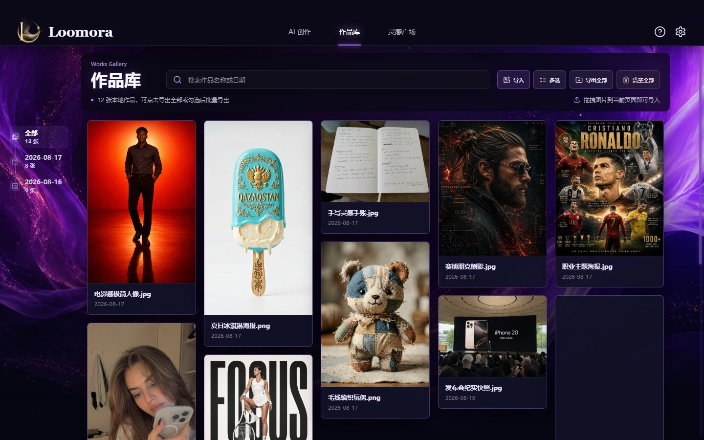
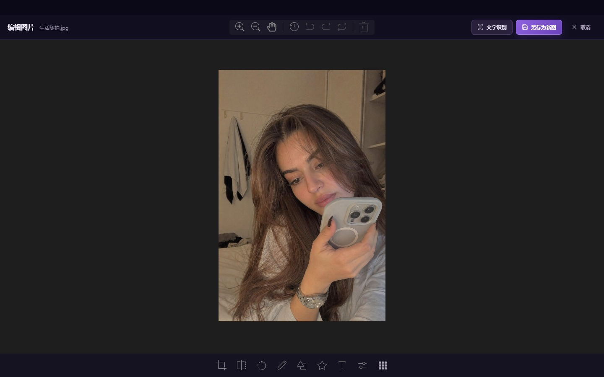

# Loomora · 织光成画

> 一站式 AI 图片创作、管理与编辑桌面工作台。

[](https://www.electronjs.org/)
[](https://vuejs.org/)
[](https://vitejs.dev/)
[](#运行环境)
[](#license)

Loomora 是一款基于 Electron、Vue 3 和 Vite 构建的跨平台 AI 图片桌面应用。它将 GPT Image 2 创作、聊天式历史、本地作品库、灵感复用、图片编辑和离线 OCR 集中在同一个紫色工作台中，并支持配置兼容 OpenAI 协议的服务地址。


## 核心能力

| 模块       | 现有能力                                                         |
| ---------- | ---------------------------------------------------------------- |
| AI 创作    | GPT Image 2、单张流式预览、最多 10 张批量生成、最多 16 张参考图  |
| 画面控制   | 7 种常用比例、自动/2K/4K 等分辨率、质量与 PNG/JPEG/WEBP 输出格式 |
| 创作历史   | 聊天式记录、继续编辑与重新生成、按需加载历史、定位本地成图       |
| 本地作品库 | 按日期归档、最新作品优先、瀑布流、搜索、时间轴、导入与批量管理   |
| 灵感广场   | 72 组内置本地案例、搜索与分类筛选、一键复用提示词或参考图        |
| 图片处理   | TOAST UI 图片编辑、马赛克、历史记录、另存为新图、本地 OCR        |
| 桌面体验   | 系统文件框、托盘与任务栏图标、Windows/macOS 自定义窗口适配       |

## 本地作品库



- 作品按 `Gallery/YYYY-MM-DD/` 归档，并按照最新日期、最新修改时间优先展示。
- 原图比例瀑布流会随窗口宽度自动调整列数；日期时间轴、搜索和筛选可以快速定位作品。
- 可通过“导入图片”多选本地图片，也可将外部图片直接拖入作品库区域。
- 支持大图预览、复制、重命名、下载、识别文字、编辑、作为参考图创作、重新生成、打开文件位置和删除。
- 支持多选导出与删除，以及导出全部或当前日期作品。
- 下载会先打开系统“另存为”窗口，由用户确认文件名和保存位置后再写入文件。
- 图库采用元数据优先、图片按需加载和窗口化渲染，减少大型作品库的初次加载压力。

## 灵感广场


内置灵感图片和提示词均随应用保存在本地，浏览时不依赖远程图片地址。可以按主题筛选或搜索，使用“用此灵感创作”回填提示词和推荐画面规格，也可以直接将案例作为参考图开始创作。

## 图片编辑与 OCR



- 图片编辑器基于 TOAST UI Image Editor，界面与工具提示均已中文化。
- 支持裁剪、翻转、旋转、涂鸦、形状、图标、文字、滤镜、颜色/透明度控制和画布缩放。
- 马赛克工具支持笔刷大小调节、实时预览，并纳入统一的撤销、重做和历史记录。
- 编辑结果通过系统文件框“另存为新图”，确认文件名和位置后保存，不覆盖原图；新图使用保存时的最新日期进入作品库。
- Paddle.js OCR 模型随应用保存在本地，在独立隐藏渲染进程中完成识别，无需额外配置在线 OCR 服务。
- OCR 可从大图预览、作品右键菜单和编辑器进入，识别结果支持一键复制。

## AI 创作

- 当前使用 `gpt-image-2`，提示词上限为 4000 个字符，单次最多生成 10 张图片。
- 支持 `1:1`、`16:9`、`9:16`、`4:3`、`3:4`、`3:2` 和 `2:3` 画面比例。
- 支持自动尺寸以及常用 2K、4K 规格，输出格式可选 `PNG`、`JPEG` 或 `WEBP`。
- 最多添加 16 张参考图，可通过文件框选择，也可使用 `Ctrl+V` 从剪贴板粘贴。
- 单张生成使用流式中间图预览；批量生成使用一次返回多张结果的 `n` 请求。
- 每轮创作会保存提示词、参数、参考图信息、进度和结果，可复制、编辑、删除或重新生成。
- 启动时按需恢复最近的历史对话，滚动到边界后继续加载，避免一次渲染全部图片。
- 点击左上角 Logo 或 Loomora 文字可以回到创作首屏，同时保留尚未发送的输入内容。

## 六步新手引导

首次启动会通过蒙层、高亮区域和虚线曲线箭头依次介绍：

1. 配置图像服务地址和 API Key。
2. 在快速创作区域填写提示词、画面规格和参考图。
3. 查看、编辑和延续历史创作。
4. 在作品库管理本地图片。
5. 从灵感广场复用案例与提示词。
6. 点击左上角 Logo 或文字返回创作首屏。

引导不会使用传统居中弹窗遮挡整个流程，也可以从“关于与帮助”中的“查看新手引导”随时重新打开。

## 使用流程

1. 点击右上角设置图标，填写 API Key，并确认接口地址与本地存储目录。
2. 输入提示词，选择画面比例、分辨率、质量、输出格式和生成数量。
3. 按需添加参考图，点击“生成”查看流式预览或批量结果。
4. 在历史创作中继续修改提示词，或将已有作品作为参考图重新创作。
5. 前往作品库查看、导入、编辑、识别、导出和整理图片。
6. 在灵感广场搜索案例，一键复用提示词或图片素材。

## 数据与隐私

- 生成图片默认保存到 `Gallery/YYYY-MM-DD/`，当天的创作记录保存在同目录的 `conversations.json`。
- Windows 开发版和打包版优先使用程序目录下的 `Gallery/`；目录不可写时回退到 Electron 用户数据目录。
- macOS 打包版优先使用 Electron 用户数据目录，避免向 `.app` 应用包内部写入内容。
- 可在设置中更换本地存储目录；已有目录仍会参与历史与作品读取，无需强制迁移。
- API Key 和接口地址保存在当前设备渲染进程的 `localStorage` 中。API Key 为明文存储，请仅在可信设备上使用。
- 图片生成请求会发送到用户配置的 OpenAI 或兼容服务；图库管理、图片编辑和 OCR 均在本地执行。

## 快速开始

### 运行环境

- Windows 10/11 或 macOS
- Node.js 18+
- npm 9+

### 安装与开发

```bash
npm install
npm start
```

`npm start` 会同时启动 Vite 开发服务和 Electron 窗口。渲染层修改支持热更新，Electron 主进程相关修改会自动重启窗口。

### 构建与运行

```bash
npm run build:ui
npm run start:prod
```

前端构建产物写入 `renderer-dist/`。

### 打包桌面应用

```bash
npm run dist

# 指定平台
npm run dist:win
npm run dist:mac
```

Windows 生成 NSIS 安装包，macOS 生成 DMG 安装包。跨平台打包仍需满足 electron-builder 对目标系统和签名工具的要求。

### 代码格式

```bash
npm run format
npm run format:check
```

## API 约定

Loomora 默认向 `https://api.openai.com` 的以下接口发送请求，也可在设置中切换到兼容 OpenAI 协议的服务地址：

```text
POST /v1/images/generations
POST /v1/images/edits
```

无参考图时使用 JSON 请求：

```json
{
  "model": "gpt-image-2",
  "prompt": "画面描述",
  "size": "2048x1152",
  "quality": "auto",
  "output_format": "png",
  "stream": true,
  "partial_images": 2
}
```

有参考图时使用 `/v1/images/edits`，并通过 multipart 表单的 `image[]` 字段上传图片。单张生成启用流式预览；数量大于 1 时使用非流式请求和 `n` 参数。

`gpt-image-2` 尺寸会按照应用中的约束进行校验：宽高不小于 1024、均为 16 的倍数、宽高比小于 3:1，并且总像素不超过 16,777,216。

## 技术栈

| 用途       | 技术                                         |
| ---------- | -------------------------------------------- |
| 桌面运行时 | Electron 31                                  |
| 前端框架   | Vue 3                                        |
| 开发与构建 | Vite 5                                       |
| 图标组件   | Lucide Vue Next                              |
| 图片编辑   | TOAST UI Image Editor                        |
| 文字识别   | Paddle.js OCR                                |
| 桌面打包   | electron-builder（Windows NSIS / macOS DMG） |

主进程负责窗口生命周期、生成请求、本地文件和系统对话框；渲染进程通过启用 `contextIsolation` 的预加载桥接调用桌面能力，未开启 Node.js 集成。OCR 使用独立的隐藏工作窗口，避免模型推理阻塞主界面。

## 项目结构

```text
Loomora/
├── electron/
│   ├── gallery.js                  # 图库、存储设置、系统对话框与 IPC
│   ├── generation.js               # 图片生成请求与流式事件
│   ├── ocr.js                      # OCR 工作窗口与任务调度
│   └── ocr-preload.js              # OCR 工作窗口安全桥接
├── renderer/
│   ├── assets/                     # 品牌、头像与灵感图片资源
│   ├── public/models/ocr/          # 本地 PaddleOCR 模型
│   ├── src/
│   │   ├── components/             # 页面与弹层组件
│   │   ├── composables/             # 生成、编辑器与 OCR 逻辑
│   │   ├── config/                  # 模型与编辑器配置
│   │   ├── data/                    # 内置灵感数据
│   │   └── utils/                   # 通用工具函数
│   └── styles/                     # 按功能拆分的界面样式
├── docs/screenshots/               # README 实际界面截图
├── scripts/                        # 开发辅助脚本
├── main.js                         # Electron 主进程入口
├── preload.js                      # 主窗口安全桥接
├── ocr-worker.html                 # OCR 工作窗口入口
└── vite.config.mjs                 # Vite 配置
```

## License

Apache-2.0
